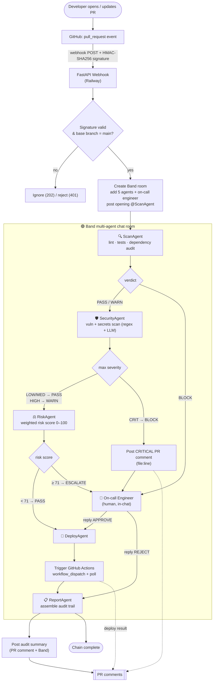
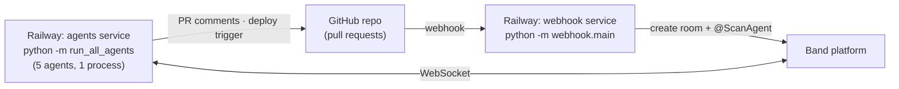

# DeployGuard — Architecture & Pipeline

DeployGuard is a multi-agent CI/CD security gate. When a pull request is opened, a GitHub
webhook spins up a [Band](https://band.ai) chat room where **five specialist AI agents**
review the change in sequence — linting, scanning for vulnerabilities, scoring risk, and
deciding whether to deploy — with a human on-call engineer in the loop for escalations.

## End-to-end pipeline

## The agents

| # | Agent | Tools | Decision |
|---|-------|-------|----------|
| 1 | 🔍 **ScanAgent** | `github_api`, `static_analyzer` (ruff), `test_runner` (pytest), `dep_auditor` (pip-audit) | hand off to SecurityAgent, or **BLOCK** to engineer |
| 2 | 🛡️ **SecurityAgent** | `security_scanner` (regex + LLM), `github_api` | LOW/MED → PASS, HIGH → WARN → RiskAgent; **CRIT → BLOCK** + PR comment → engineer |
| 3 | ⚖️ **RiskAgent** | `risk_scorer` (weighted heuristics) | score `< 71` → DeployAgent; score `≥ 71` → **ESCALATE** to engineer, await APPROVE/REJECT |
| 4 | 🚀 **DeployAgent** | `deploy_trigger` (`workflow_dispatch`), `github_api` | fire the real deploy **only if approved** → ReportAgent |
| 5 | 📋 **ReportAgent** | `github_api` | post the full audit trail; always runs last |

## Risk scoring (RiskAgent)

Weighted heuristics → a 0–100 score; **≥ 71 escalates to a human**:

| Signal | Weight |
|--------|--------|
| Auth-related files changed | +30 |
| Payment-related files changed | +40 |
| Friday deploy | +15 |
| Diff > 500 lines | +10 |
| Each upstream WARN | +5 (cap 20) |

## Two paths through the chain

- **Clean PR (happy path):** `Scan → Security → Risk → Deploy → Report` — ends in a real deployment and an audit comment.
- **Risky / vulnerable PR (block path):** the chain **stops early** — a CRIT finding blocks the deploy and escalates to the engineer, who can `APPROVE`/`REJECT` in the same chat.

## Tech stack

| Layer | Technology |
|-------|------------|
| Multi-agent orchestration | **Band** (agent chat + `@mention` hand-offs) |
| Agent runtime | **LangGraph** ReAct agents |
| LLMs | **Featherless** (Qwen models) |
| Ingress | **FastAPI** webhook (HMAC-verified) |
| Source / CI | **GitHub** PRs + Actions (`workflow_dispatch`) |
| Hosting | **Railway** (2 services: `webhook` + `agents`) |

## Deployment topology

