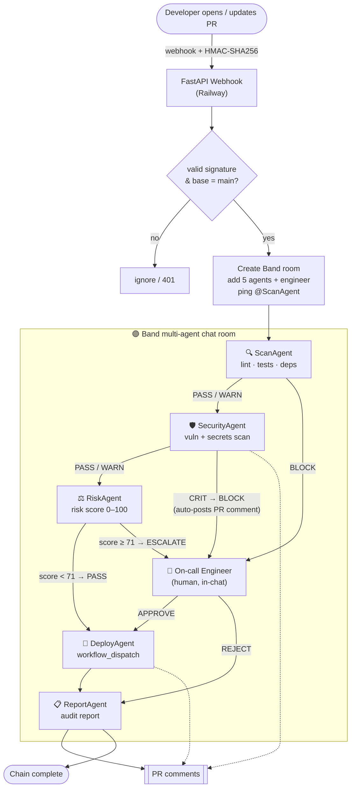

# 🛡️ DeployGuard

### Multi-agent CI/CD security gate — five specialist AI agents that review every pull request *together* and block vulnerable code before it ships.

> Built for the **Band of Agents Hackathon (Track 2)**. Live, deployed, and end-to-end automated.

DeployGuard turns code review from a human bottleneck into an autonomous, auditable team. When a pull request opens, a GitHub webhook spins up a [Band](https://www.band.ai) chat room where five agents — **Scan, Security, Risk, Deploy, Report** — collaborate via `@mentions`, each with a distinct job. Critical findings **block the deployment** and escalate to a human *in the same chat*. Remove Band and the chain collapses: DeployAgent never receives its green light.

---

## Why it's different

Most "AI code reviewers" are a single model with a long prompt. DeployGuard is a **real review team**:

- 🧩 **True multi-agent collaboration** — five independent Band identities, separate tools and prompts, communicating through real chat hand-offs (not one model role-playing five).
- 🚦 **It takes a real action** — gates an actual GitHub Actions deployment (`workflow_dispatch`), not just text output.
- 👤 **Human-in-the-loop, in-channel** — escalations `@mention` the on-call engineer, who replies `APPROVE` / `REJECT` inline.
- 🔒 **Deterministic where it matters** — verdicts, the CRIT block comment, and the audit report are produced by **code, not model judgment**, so the security outcome is reliable even on small open-source models. (See [Engineering for reliability](#engineering-for-reliability).)
- ☁️ **Actually deployed** — live webhook + all five agents running in the cloud on Railway.

---

## How it works



- **Clean PR (happy path):** `Scan → Security → Risk → Deploy → Report` → deploys automatically and posts an audit report.
- **Vulnerable PR (block path):** the chain **fails fast** — SecurityAgent catches the issue, auto-posts a `CRITICAL` PR comment, blocks the deploy, and escalates to the engineer.

> 📐 Full pipeline, decision branches, risk weights, and deployment topology: **[ARCHITECTURE.md](ARCHITECTURE.md)**

---

## The five agents

| # | Agent | Responsibility | Tools | Outcome |
|---|-------|----------------|-------|---------|
| 1 | 🔍 **ScanAgent** | static analysis, tests, dependency CVEs | `ruff`, `pytest`, `pip-audit`, GitHub | PASS / WARN / BLOCK |
| 2 | 🛡️ **SecurityAgent** | deep vulnerability + secrets scan | `security_review` (OWASP regex + auto-comment) | PASS / WARN / **BLOCK** |
| 3 | ⚖️ **RiskAgent** | weighted risk score (auth/payment files, diff size, day) | `risk_scorer` | PASS / **ESCALATE** |
| 4 | 🚀 **DeployAgent** | fires the real deployment *only if approved* | `deploy_trigger` (`workflow_dispatch`) | DEPLOYED / HELD |
| 5 | 📋 **ReportAgent** | posts the final audit report | `post_audit_report` | always closes the chain |

A human gate sits between Risk and Deploy: on **ESCALATE**, the engineer replies `APPROVE` / `REJECT` directly in the Band room.

---

## Engineering for reliability

Small open-source models are cheap but inconsistent at multi-step orchestration. DeployGuard pushes every **security-critical decision into deterministic code**, so the model only does the talking:

- **`security_review`** fetches the diff, scans it, and **auto-posts the CRITICAL block comment itself** — the block never depends on the model remembering to.
- **`post_audit_report`** reconstructs the outcome from real signals (the block comment + the deploy run) and posts a clean audit table — no chat-history parsing required.
- **Self-healing identifiers** — if a model passes a placeholder repo/PR, the GitHub tools snap to the configured target and its open PR, so the chain always acts on the real PR.
- **Fail-closed** — if a diff can't be fetched, SecurityAgent escalates for manual review; it never silently approves.
- **Hand-off discipline** — one delivery per turn, mention allow-listing, and reconnect-resilient agents (`temperature 0` for deterministic decoding).

Result: the demo's hero artifacts — the **CRITICAL block** and the **audit report** — land on every run.

---

## Tech stack

| Layer | Technology |
|-------|------------|
| Multi-agent orchestration | **Band** (`band-sdk[langgraph]`) — `@mention` routing is the chain |
| Agent runtime | **LangGraph** ReAct agents |
| LLMs | **Featherless** (Qwen, OpenAI-compatible) |
| Ingress | **FastAPI** webhook, HMAC-SHA256 verified |
| Source / CI | **GitHub** PRs + Actions (`workflow_dispatch`), **PyGithub** |
| Hosting | **Railway** — 2 services: `webhook` (public) + `agents` (all five) |
| Quality | **pytest** · **ruff** · **black** · **Docker** · GitHub Actions CI |

---

## Quickstart

```bash
python -m venv .venv && .venv/Scripts/activate    # Windows  (use source .venv/bin/activate on *nix)
pip install -r requirements.txt
cp .env.example .env                              # fill in Band + Featherless + GitHub credentials
pytest -q                                         # 22 passing — no network/credentials needed
```

**Run locally**

```bash
python -m webhook.main        # webhook on :8000  (binds $PORT in the cloud)
python -m run_all_agents      # all five agents in one process
```

**Deploy (Railway)** — two services from this repo:

| Service | Start command | Public domain |
|---------|---------------|---------------|
| `webhook` | `python -m webhook.main` | ✅ (GitHub webhook target `…/webhook`) |
| `agents`  | `python -m run_all_agents` | — |

Then add a **Pull requests** webhook on the target repo pointing at `https://<webhook-domain>/webhook` with your `GITHUB_WEBHOOK_SECRET`. Open a PR and watch the chain run.

---

## Repository layout

```
agents/        five chain agents (scan, security, risk, deploy, report)
tools/         deterministic tools: security scan, risk scoring, GitHub, deploy, audit
shared/        Band runtime wiring, LLM factory, handles, schemas
webhook/       FastAPI receiver: HMAC verify → parse → initiate Band chain
run_all_agents.py   run all five agents in one service (fits PaaS service caps)
ARCHITECTURE.md     full pipeline + topology diagrams
```

---

## Project status

✅ **Live and end-to-end automated** — webhook + five agents deployed on Railway; PRs auto-trigger the chain; the security block and audit report are deterministic. See **[current-state.md](current-state.md)** for the detailed log and **[ARCHITECTURE.md](ARCHITECTURE.md)** for the design.

*Single-token demo today; multi-tenant review across arbitrary repositories is the production path via a GitHub App.*

---

## Team

- **Dan16ssd** — [@Dan16ssd](https://github.com/Dan16ssd)
- **KRIT** — [@thavisoukdouangphachanh-boop](https://github.com/thavisoukdouangphachanh-boop)
- **MichelBLV64** — [@MichelBLV64](https://github.com/MichelBLV64)

Built for the Band of Agents Hackathon (Track 2).
