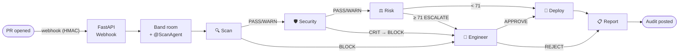

# 🛡️ DeployGuard

**Multi-agent production-deployment safety system** — built for the Band of Agents Hackathon (Track 2).

Every PR against `main` triggers a **sequential approval chain of five agents** that coordinate **exclusively through [Band](https://www.band.ai) @mentions**. Code cannot deploy until it survives all of them — or a human explicitly overrides a block in the Band chat room. Remove Band and the chain collapses: DeployAgent never receives its green light.



> 📐 **Full pipeline, decision branches, risk weights, and deployment topology: [ARCHITECTURE.md](ARCHITECTURE.md)**

## The chain

| # | Agent | Role | Verdicts |
|---|-------|------|----------|
| 1 | **ScanAgent** | static analysis, tests, CVEs | PASS / WARN / BLOCK |
| 2 | **SecurityAgent** | deep vuln + secrets scan (regex + LLM) | PASS / WARN / BLOCK |
| 3 | **RiskAgent** | holistic risk score 0–100 | PASS / WARN / ESCALATE |
| 4 | **Human gate** | engineer replies in Band | APPROVE / REJECT |
| 5 | **DeployAgent** | fires real GitHub Actions deploy | DEPLOYED / HELD |
| 6 | **ReportAgent** | audit trail → room + PR comment | always runs |

## Stack

- **Band SDK** (`band-sdk[langgraph]`) — @mention routing is the entire chain mechanism
- **LangGraph adapter** + open-source models via **Featherless** / **AI/ML API** (OpenAI-compatible)
- **FastAPI** webhook receiver (HMAC-verified) · **PyGithub** for diffs/comments/`workflow_dispatch`
- **pytest** · **Docker Compose** · **GitHub Actions** CI/CD · **Railway** hosting

## Status

Early build. See **[current-state.md](current-state.md)** for exactly what's done and what's next, and **[PLAN.md](PLAN.md)** for the full implementation plan.

## Setup (in progress)

```bash
python -m venv .venv && .venv/Scripts/activate   # Windows
pip install -r requirements.txt
cp .env.example .env                              # then fill in credentials
pytest -q
```

Register 5 agents at <https://app.band.ai>, add their IDs/keys plus Featherless + GitHub tokens to `.env`, then run the Spike A connectivity check:

```bash
python -m spike.spike_a_echo_agent
```
